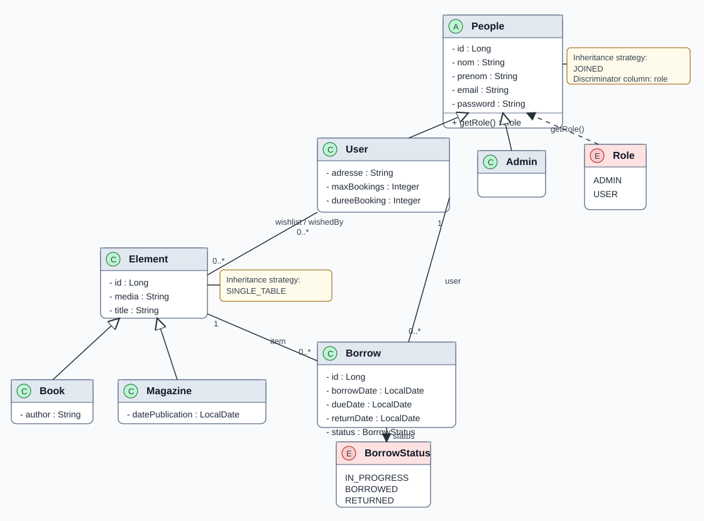

# Projet de gestion de bibliotheque

Application Java/JPA pour gerer une bibliotheque composee de livres et de magazines. Les utilisateurs consultent les elements disponibles et demandent des emprunts. L'administrateur gere le catalogue et suit les demandes.

## Fonctionnalites

- Authentification par JWT avec roles `USER` et `ADMIN`
- Gestion des utilisateurs
- Gestion des elements du catalogue
- Creation de livres et de magazines
- Creation et suivi des emprunts
- Consultation des emprunts d'un utilisateur donne
- Documentation d'API via Swagger UI

## Modele metier

Le domaine est organise autour de deux hierarchies principales:

- `People` est specialise en `User` et `Admin`
- `Element` est specialise en `Book` et `Magazine`

Les emprunts (`Borrow`) relient un utilisateur a un element du catalogue, avec un statut parmi `IN_PROGRESS`, `BORROWED`, `RETURNED` et `LATE`.

<p align="center">
  
</p>

Le fichier source PlantUML est disponible ici: [`docs/class-diagram.puml`](docs/class-diagram.puml).

## API principale

| Ressource | Methode | Route | Description |
| --- | --- | --- | --- |
| Auth | `POST` | `/auth/login` | Connexion et generation du token JWT |
| Users | `GET` | `/users/` | Liste des utilisateurs |
| Users | `POST` | `/users/` | Creation d'un utilisateur |
| Elements | `GET` | `/element` | Liste des livres et magazines |
| Elements | `POST` | `/element/book` | Creation d'un livre |
| Elements | `POST` | `/element/magazine` | Creation d'un magazine |
| Borrow | `GET` | `/borrow/` | Liste des emprunts |
| Borrow | `GET` | `/borrow/user/{userId}` | Emprunts d'un utilisateur |
| Borrow | `POST` | `/borrow/` | Creation d'un emprunt |

## Demarrage

### Prerequis

- Java 16 ou plus
- Maven
- HSQLDB

### Lancer la base de donnees

Dans un premier terminal:

```bash
./run-hsqldb-server.sh
```

Sous Windows:

```bat
run-hsqldb-server.bat
```

### Ouvrir l'interface HSQLDB

Dans un deuxieme terminal:

```bash
./show-hsqldb.sh
```

Sous Windows:

```bat
show-hsqldb.bat
```

### Initialiser les donnees

Executer [`JpaTest.java`](src/main/java/jpa/JpaTest.java). Ce fichier initialise les entites et cree notamment un compte administrateur:

```text
email: admin@gmail.com
password: Azerty123?
```

### Lancer l'API

Executer [`RestServer.java`](src/main/java/rest/RestServer.java), puis ouvrir:

```text
http://localhost:8080/api/
```

## Exemples JSON

Creation d'un livre:

```json
{
  "title": "Dune",
  "author": "Frank Herbert",
  "media": "dune-cover.jpg"
}
```

Creation d'un magazine:

```json
{
  "title": "Science Magazine",
  "media": "science-cover.jpg",
  "datePublication": "2026-05-13"
}
```

Creation d'un emprunt:

```json
{
  "userId": 1,
  "itemId": 2
}
```

## Structure du projet

```text
src/main/java/jpa/domain      Entites JPA
src/main/java/jpa/dto         Objets de transfert
src/main/java/jpa/dao         Acces aux donnees
src/main/java/jpa/service     Logique metier
src/main/java/rest            Ressources REST
src/main/webapp/swagger       Swagger UI
```
